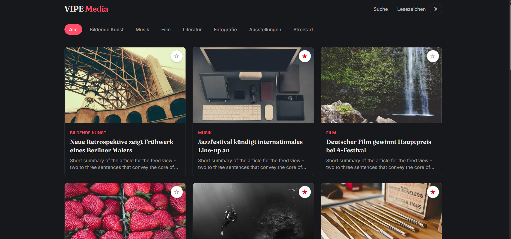

# VIPE Media

Editorial news feed for art and culture, built with React, TypeScript and Next.js — with a Prisma/Postgres backend, NewsAPI-powered content ingestion, and account-based features (Better Auth).


🔗 [Live Demo](https://vipe-media.vercel.app)

## Screenshots

### Feed


### Search


### Bookmarks


### Dark Mode



## Features

### Content

- Article feed with infinite scroll (IntersectionObserver)
- Category filter: Fine Arts, Music, Film, Literature, Exhibitions
- Live search over title and description
- Article detail pages with dynamic routes
- Skeleton loading states
- Articles are ingested from NewsAPI via a scheduled cron endpoint (per-category search queries + keyword filtering), stored in Postgres, and served from there — not fetched live on each request

### Accounts & Bookmarks

- Email/password accounts via Better Auth
- Sign-up requires email verification (Resend-delivered link) before sign-in is allowed
- Self-service password reset ("Forgot password?" on the login page), also via a Resend-delivered link
- Bookmarks are tied to your account (stored in Postgres), not just the browser — toggle a bookmark, see it on any device you log into
- Logged-out visitors can still see the bookmark button; clicking it shows an inline "please log in" hint instead of a redirect, so they stay in reading context
- `/account` is a protected route (session-checked server-side)

### Security

- Rate limiting on sign-in/sign-up/password-reset (Better Auth's built-in limiter, Postgres-backed) to curb credential stuffing, mass fake-account creation, and reset-link spam
- Separate, lightweight in-memory rate limiting on the bookmarks endpoint
- Kept on a patched Next.js version (a pre-auth RCE affecting earlier 16.x releases is fixed)

### Design

- Custom editorial design: warm paper/ink palette, Fraunces (headlines) + Inter (body), single red accent
- Dark mode (system preference + manual toggle, via next-themes)
- Legal pages: imprint, privacy policy, terms of service

## Tech Stack

- **React 19** + **TypeScript**
- **Next.js 16** (App Router, Turbopack)
- **Tailwind CSS v4**
- **lucide-react** for icons
- **PostgreSQL** (Neon), accessed via **Prisma 7** with the `@prisma/adapter-neon` driver adapter
- **Better Auth** for email/password accounts, sessions, and rate limiting
- **Resend** for verification and password-reset emails
- **NewsAPI** for article ingestion, via a Vercel Cron-triggered endpoint
- `@upstash/redis` is installed for future use, not currently wired up

## Project Structure

```
app/
├── page.tsx                        Homepage (feed)
├── layout.tsx                      Root layout, fonts, header
├── globals.css                     Color tokens & fonts (Tailwind v4)
├── article/[id]/page.tsx           Article detail
├── bookmarks/page.tsx              Bookmarked articles (login-aware empty state)
├── search/page.tsx                 Live search
├── login/page.tsx                  Login
├── register/page.tsx               Registration
├── forgot-password/page.tsx        Request a password reset link
├── reset-password/page.tsx         Set a new password (via emailed token)
├── account/page.tsx                Protected account page (session-checked)
├── imprint/page.tsx                Legal: imprint
├── privacy-policy/page.tsx         Legal: privacy policy
├── terms-of-service/page.tsx       Legal: terms of service
└── api/
    ├── articles/route.ts           GET articles (pagination, category filter, search, ids lookup)
    ├── auth/[...all]/route.ts      Better Auth handler (catch-all)
    ├── bookmarks/route.ts          GET bookmarked article IDs, POST toggle (rate-limited)
    └── cron/fetch-news/route.ts    Scheduled NewsAPI ingestion (CRON_SECRET-protected)

components/
├── header.tsx                      Top bar with logo, search, bookmarks link, theme toggle, user menu
├── article-feed.tsx                Feed logic: filtering + infinite scroll + skeletons
├── category-nav.tsx                Category filter bar
├── article-card.tsx                Single article card
├── bookmark-button.tsx             Bookmark toggle button (DB-backed, login-aware)
├── site-footer.tsx                 Footer with legal links
├── legal-page.tsx                  Shared layout for legal pages
├── theme-provider.tsx              next-themes wrapper (client boundary for layout.tsx)
├── theme-toggle.tsx                Dark mode toggle button
└── auth/
    ├── user-menu.tsx                Session-aware avatar dropdown / login-register buttons
    ├── editorial-panel.tsx          Side panel on login/register screens
    ├── fields.tsx                   Shared text/password input components
    └── form-message.tsx             Shared success/error message component

lib/
├── auth.ts                         Better Auth server config (Prisma adapter, rate limiting, multi-host baseURL, Resend email handlers)
├── auth-client.ts                  Better Auth client (signIn/signUp/signOut/useSession/requestPasswordReset/resetPassword)
├── prisma.ts                       Prisma client (Neon driver adapter)
├── newsapi.ts                      NewsAPI fetching + per-category keyword filtering
├── rate-limit.ts                   In-memory rate limiter for non-auth API routes
├── password-strength.ts            Password strength validation for registration
├── mock-data.ts                    Category labels/types only (articles now come from the DB)
└── utils.ts                        cn() helper for merging Tailwind classes

prisma/
└── schema.prisma                  Article, User, Session, Account, Verification, Bookmark, RateLimit

docs/
└── screenshots/                    Screenshots of the VIPE Media website
```

## Getting Started

### 1. Install dependencies

```bash
npm install
```

### 2. Set up the database

Create a PostgreSQL database (e.g. on [Neon](https://neon.tech)) and run the migrations:

```bash
npx prisma migrate deploy
```

### 3. Configure environment variables

Create a `.env` file:

```
# Postgres (Neon) - pooled connection, used at runtime
DATABASE_URL=your_pooled_connection_string

# Postgres (Neon) - direct connection, used by Prisma migrations only
DATABASE_URL_UNPOOLED=your_direct_connection_string

# Better Auth - random secret used to sign sessions/cookies
BETTER_AUTH_SECRET=your_generated_secret

# Resend API key, used to send email verification and password-reset emails.
# Sending "from" a verified domain requires setting one up in Resend
# (see lib/auth.ts) - without one, mail can only be sent to the address
# on your own Resend account.
RESEND_API_KEY=your_resend_api_key

# NewsAPI key, used by the cron ingestion endpoint
NEWSAPI_KEY=your_newsapi_key

# Shared secret required in the Authorization header to trigger
# the cron ingestion endpoint
CRON_SECRET=your_generated_secret
```

Generate secrets with:

```bash
npx auth secret
```

### 4. Run the app

```bash
npm run dev
```

The app runs at [http://localhost:3000](http://localhost:3000).

## Content Ingestion

Articles aren't fetched live — they're pulled from NewsAPI ahead of time and stored in Postgres. `app/api/cron/fetch-news/route.ts` runs per category with its own search queries and keyword filtering, then upserts results (deduplicated by source URL, since NewsAPI doesn't provide a stable article ID). It's intended to run on a schedule via Vercel Cron and requires the `CRON_SECRET` bearer token to execute.

## Deployment

Deployed on Vercel: [vipe-media.vercel.app](https://vipe-media.vercel.app). No custom domain yet — `lib/auth.ts` allows both `localhost:3000` and any `*.vercel.app` host (including per-branch preview deployments) via Better Auth's `baseURL.allowedHosts`. Verification/reset emails are sent from the `vipemedia.pixelstack.me` subdomain, verified in Resend.

## Planned Next Steps

- [ ] Custom domain
- [ ] Wire up `@upstash/redis` (currently installed, unused) if traffic ever outgrows the in-memory/database rate limiters
- [ ] Premium tier (hinted at in the account UI, not yet built)
- [ ] Breaking news ticker (WebSocket)
