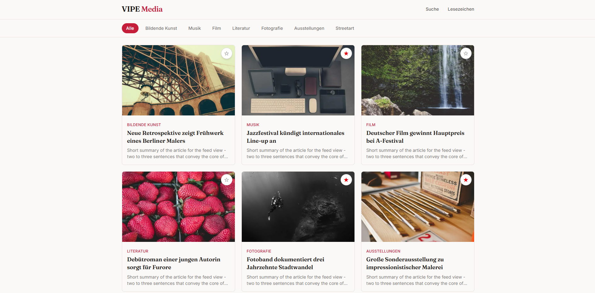
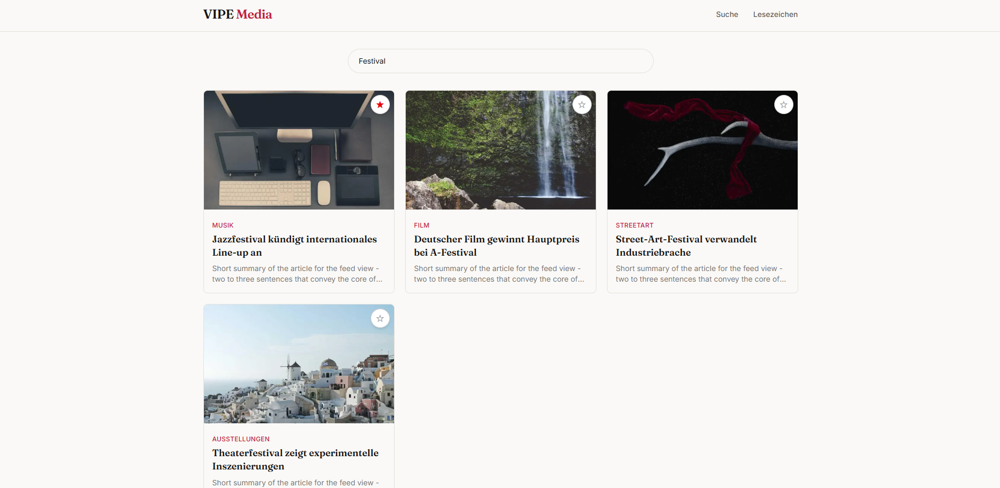
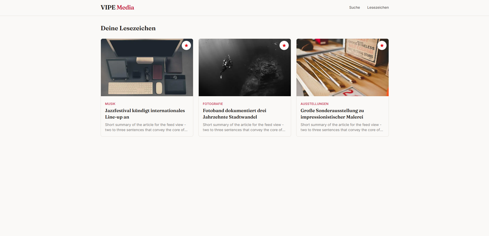

# VIPE Media

Editorial news feed for art and culture, built with React, TypeScript and Next.js.


> Current state: frontend scaffold — not yet connected to a database or API.

## Screenshots

### Feed



### Search



### Bookmarks



## Features (current)

- Article feed with infinite scroll (IntersectionObserver)
- Category filter: Fine Arts, Music, Film, Literature, Photography, Exhibitions, Street Art
- Live search over title and description
- Bookmarks (persisted in `localStorage`)
- Article detail page with dynamic route
- Skeleton loading states
- Custom editorial design: warm paper/ink palette, Fraunces (headlines) + Inter (body), single red accent

## Tech Stack

- **React 19** + **TypeScript**
- **Next.js 16** (App Router, Turbopack)
- **Tailwind CSS v4**
- **lucide-react** for icons

Already installed for upcoming work: `@prisma/client` + `prisma`, `@upstash/redis`, `next-themes`.

## Project Structure

```
app/
├── page.tsx                  Homepage (feed)
├── layout.tsx                Root layout, fonts, header
├── globals.css               Color tokens & fonts (Tailwind v4)
├── article/[id]/page.tsx     Article detail
├── bookmarks/page.tsx        Bookmarked articles
└── search/page.tsx           Live search

components/
├── header.tsx                Top bar with logo, search, bookmarks link
├── article-feed.tsx          Feed logic: filtering + infinite scroll + skeletons
├── category-nav.tsx          Category filter bar
├── article-card.tsx          Single article card
└── bookmark-button.tsx       Bookmark toggle button

lib/
├── mock-data.ts              Placeholder data (NOTE: temporary!)
└── utils.ts                  cn() helper for merging Tailwind classes

docs/
└── screenshots/              Screenshots of the VIPE media website
```

## Getting Started

```bash
npm install
npm run dev
```

The app runs at [http://localhost:3000](http://localhost:3000).

## About the Mock Data

`lib/mock-data.ts` currently provides placeholder articles and categories
so the UI can be built and tested independently of the backend. This file
is expected to change significantly (or be replaced entirely) once the
database and API layer are connected.

## Planned Next Steps

- [ ] Dark mode
- [ ] Backend: Prisma schema, Neon database, NewsAPI integration
- [ ] Redis caching for API responses
- [ ] NextAuth.js for real user accounts (server-side bookmarks)
- [ ] Breaking news ticker (WebSocket)
