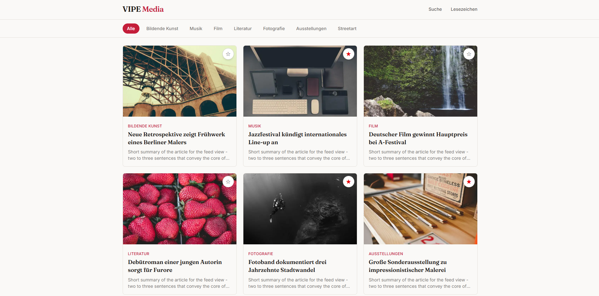
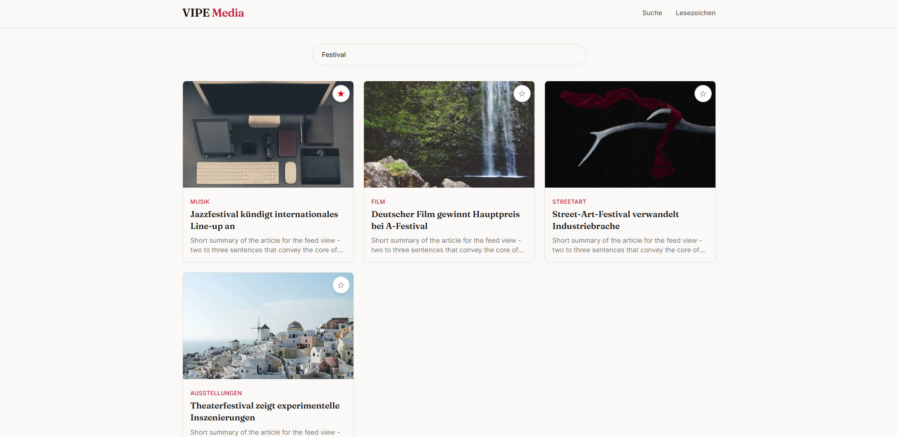
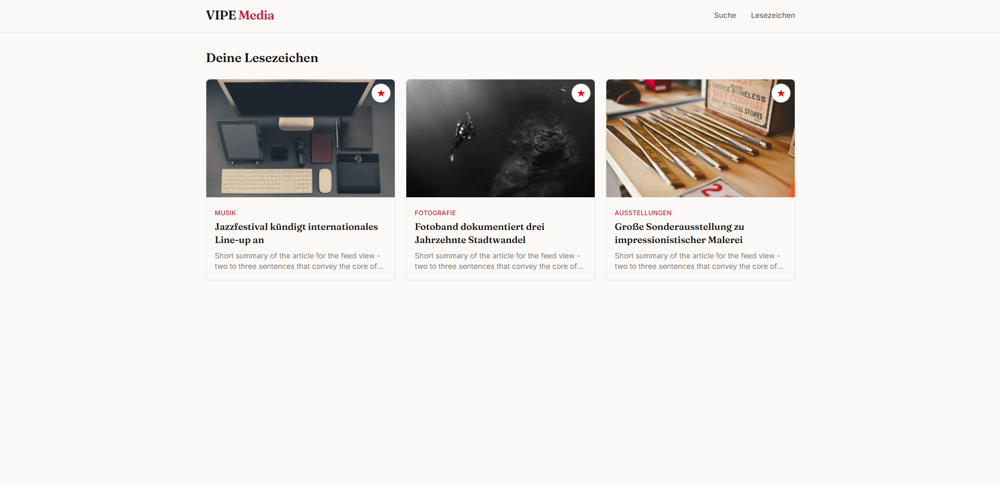
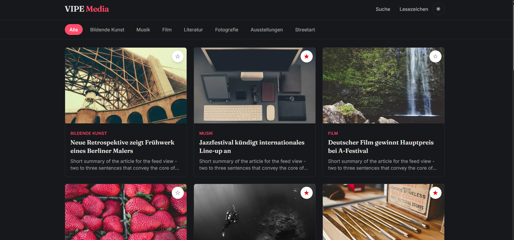

# VIPE Media

Editorial news feed for art and culture, built with React, TypeScript and Next.js — with a Prisma/Postgres backend, NewsAPI-powered content ingestion, account-based features (Better Auth), and a Premium-gated daily AI Kultur-Briefing.


🔗 [Live Demo](https://vipe-media.vercel.app)

## Screenshots

### Feed



### Search



### Bookmarks



### Dark Mode



## Features

### Content

- Article feed with category filter (Fine Arts, Music, Film, Literature, Exhibitions)
- Explicit **“Load more”** pagination (cursor-based API, page size 12) — not infinite scroll
- Live search over title and description
- Article detail pages with dynamic routes
- Detail pages show a cleaned snippet (NewsAPI truncates full text) and a prominent link to the original source
- Skeleton loading states
- Articles are ingested from NewsAPI via a scheduled cron endpoint (per-category search queries + keyword filtering), stored in Postgres, and served from there — not fetched live on each request

### Accounts & Bookmarks

- Email/password accounts via Better Auth
- Sign-up requires email verification (Resend-delivered link) before sign-in is allowed
- Self-service password reset (“Forgot password?” on the login page), also via a Resend-delivered link
- Bookmarks are tied to your account (stored in Postgres), not just the browser — toggle a bookmark, see it on any device you log into
- Logged-out visitors can still see the bookmark button; clicking it shows an inline “please log in” hint instead of a redirect, so they stay in reading context
- `/account` is a protected route (session-checked server-side)

### Premium & AI

- User plans: `FREE` (default) and `PREMIUM` (`User.plan` in the database)
- `/premium` landing page (demo project — no real payments yet)
- **Kultur-Briefing** (Premium): daily AI summary per culture category, generated from that day’s ingested article titles/descriptions
- Briefing is generated once per day (shared), not per user; only Premium users can read it on `/briefing`
- LLM stack: Free.ai as primary, DeepSeek as fallback, with a circuit breaker when Free.ai’s budget is exhausted (402)
- Planned Premium features (not yet built): personal feed, AI culture agent

### Security

- Rate limiting on sign-in/sign-up/password-reset (Better Auth’s built-in limiter, Postgres-backed) to curb credential stuffing, mass fake-account creation, and reset-link spam
- Separate, lightweight in-memory rate limiting on the bookmarks endpoint
- Cron endpoints require `Authorization: Bearer <CRON_SECRET>`
- Kept on a patched Next.js version (a pre-auth RCE affecting earlier 16.x releases is fixed)

### Design

- Custom editorial design: warm paper/ink palette, Fraunces (headlines) + Inter (body), single red accent
- Dark mode (system preference + manual toggle, via next-themes)
- Legal pages: imprint, privacy policy, terms of service

## Tech Stack

- **React 19** + **TypeScript**
- **Next.js 16** (App Router, Turbopack)
- **Tailwind CSS v4**
- **lucide-react** for icons
- **PostgreSQL** (Neon), accessed via **Prisma 7** with the `@prisma/adapter-neon` driver adapter
- **Better Auth** for email/password accounts, sessions, and rate limiting
- **Resend** for verification and password-reset emails
- **NewsAPI** for article ingestion, via a Vercel Cron-triggered endpoint
- **LangChain** (`@langchain/openai`) + Free.ai / DeepSeek for the daily Kultur-Briefing
- `@upstash/redis` is installed for future use, not currently wired up

## Project Structure

```
app/
├── page.tsx                        Homepage (feed)
├── layout.tsx                      Root layout, fonts, header
├── globals.css                     Color tokens & fonts (Tailwind v4)
├── article/[id]/page.tsx           Article detail (snippet + source link)
├── bookmarks/page.tsx              Bookmarked articles (login-aware empty state)
├── briefing/page.tsx               Daily Kultur-Briefing (Premium-gated)
├── premium/page.tsx                Premium landing / plan-aware CTA
├── search/page.tsx                 Live search
├── login/page.tsx                  Login
├── register/page.tsx               Registration
├── forgot-password/page.tsx        Request a password reset link
├── reset-password/page.tsx         Set a new password (via emailed token)
├── account/page.tsx                Protected account page (session-checked)
├── imprint/page.tsx                Legal: imprint
├── privacy-policy/page.tsx         Legal: privacy policy
├── terms-of-service/page.tsx       Legal: terms of service
└── api/
├── articles/route.ts           GET articles (cursor pagination, category, search, ids)
├── auth/[...all]/route.ts      Better Auth handler (catch-all)
├── bookmarks/route.ts          GET bookmarked article IDs, POST toggle (rate-limited)
└── cron/
├── fetch-news/route.ts     Scheduled NewsAPI ingestion (CRON_SECRET-protected)
└── generate-briefing/route.ts  Daily AI briefing per category (CRON_SECRET-protected)

components/
├── header.tsx                      Top bar: logo, search, bookmarks, briefing, theme, user menu
├── article-feed.tsx                Feed: category filter + “Load more” + skeletons
├── category-nav.tsx                Category filter bar
├── article-card.tsx                Single article card
├── bookmark-button.tsx             Bookmark toggle (DB-backed, login-aware)
├── site-footer.tsx                 Footer with legal links
├── legal-page.tsx                  Shared layout for legal pages
├── theme-provider.tsx              next-themes wrapper (client boundary for layout.tsx)
├── theme-toggle.tsx                Dark mode toggle button
└── auth/
├── user-menu.tsx               Session-aware avatar dropdown / login-register buttons
├── editorial-panel.tsx         Side panel on login/register screens
├── fields.tsx                  Shared text/password input components
└── form-message.tsx            Shared success/error message component

lib/
├── auth.ts                         Better Auth server config
├── auth-client.ts                  Better Auth client
├── prisma.ts                       Prisma client (Neon driver adapter)
├── newsapi.ts                      NewsAPI fetching + per-category keyword filtering
├── llm.ts                          Free.ai primary + DeepSeek fallback
├── ai-provider-circuit.ts          Circuit breaker when Free.ai budget is exhausted
├── plan.ts                         isPremium() / plan constants
├── premium-features.ts             Shared Premium feature list (UI)
├── rate-limit.ts                   In-memory rate limiter for non-auth API routes
├── password-strength.ts            Password strength validation for registration
├── mock-data.ts                    Category labels/types
└── utils.ts                        cn() helper for merging Tailwind classes

prisma/
└── schema.prisma                   Article, User (plan), Session, Account, Verification,
Bookmark, RateLimit, Briefing

docs/
└── screenshots/                    Screenshots of the VIPE Media website
```

## Getting Started

### 1. Install dependencies

```bash
npm install
```

### 2. Set up the database

Create a PostgreSQL database (e.g. on [Neon](https://neon.tech)) and run the migrations:

```bash
npx prisma migrate deploy
```

### 3. Configure environment variables

Create a `.env` file:

```
# Postgres (Neon) - pooled connection, used at runtime
DATABASE_URL=your_pooled_connection_string

# Postgres (Neon) - direct connection, used by Prisma migrations only
DATABASE_URL_UNPOOLED=your_direct_connection_string

# Better Auth - random secret used to sign sessions/cookies
BETTER_AUTH_SECRET=your_generated_secret

# Resend API key, used to send email verification and password-reset emails.
# Sending "from" a verified domain requires setting one up in Resend
# (see lib/auth.ts) - without one, mail can only be sent to the address
# on your own Resend account.
RESEND_API_KEY=your_resend_api_key

# NewsAPI key, used by the cron ingestion endpoint
NEWSAPI_KEY=your_newsapi_key

# Shared secret required in the Authorization header to trigger cron endpoints
CRON_SECRET=your_generated_secret

# Free.ai (primary LLM for Kultur-Briefing)
FREE_AI_API_KEY=your_free_ai_key
# Optional — defaults to qwen7b in code
# FREE_AI_MODEL=qwen7b
# Optional — cooldown after 402 budget exhausted (ms), default 24h
# FREE_AI_COOLDOWN_MS=86400000

# DeepSeek (fallback LLM via OpenAI-compatible API)
AI_API_KEY=your_deepseek_api_key
# Optional — defaults to deepseek-v4-flash in code
# AI_MODEL=deepseek-v4-flash
```

Generate secrets with:

```bash
npx auth secret
```

### 4. Run the app

```bash
npm run dev
```

The app runs at [http://localhost:3000](http://localhost:3000).

## Content Ingestion

Articles aren't fetched live — they're pulled from NewsAPI ahead of time and stored in Postgres. `app/api/cron/fetch-news/route.ts` runs per category with its own search queries and keyword filtering, then upserts results (deduplicated by source URL, since NewsAPI doesn't provide a stable article ID).

NewsAPI only returns truncated article bodies (~200 characters). The UI therefore shows a cleaned snippet and links to the original source instead of pretending to offer full text.

### Scheduled jobs (Vercel Cron)

Configured in `vercel.json` (times in **UTC**):

| Path                          | Schedule              | Purpose                                 |
| ----------------------------- | --------------------- | --------------------------------------- |
| `/api/cron/fetch-news`        | `0 18 * * *` (18:00)  | Ingest articles from NewsAPI            |
| `/api/cron/generate-briefing` | `30 18 * * *` (18:30) | Generate daily AI briefing per category |

Both require:

```http
Authorization: Bearer <CRON_SECRET>
```

Manual trigger example:

```bash
curl -H "Authorization: Bearer $CRON_SECRET" \
  https://vipe-media.vercel.app/api/cron/fetch-news

curl -H "Authorization: Bearer $CRON_SECRET" \
  https://vipe-media.vercel.app/api/cron/generate-briefing
```

## Kultur-Briefing (Premium)

1. After ingestion, `generate-briefing` loads today’s newly fetched articles (`fetchedAt` ≥ start of UTC day) per active culture category.
2. Categories with fewer than 2 articles are skipped; at most 15 articles are sent to the model.
3. Free.ai is tried first; on budget exhaustion (402) or other failures, DeepSeek is used as fallback.
4. One briefing text per `(category, date)` is upserted into the `Briefing` table.
5. `/briefing` shows the content only if `user.plan === "PREMIUM"`; everyone else sees a locked teaser.

To test Premium without payments, set a user’s plan in the database:

```sql
UPDATE "user" SET plan = 'PREMIUM' WHERE email = 'you@example.com';
```

## Deployment

Deployed on Vercel: [vipe-media.vercel.app](https://vipe-media.vercel.app). No custom domain yet — `lib/auth.ts` allows both `localhost:3000` and any `*.vercel.app` host (including per-branch preview deployments) via Better Auth's `baseURL.allowedHosts`. Verification/reset emails are sent from the `vipemedia.pixelstack.me` subdomain, verified in Resend.

## Planned Next Steps

- [ ] Custom domain
- [ ] Demo “activate Premium” control in the UI (no Stripe yet)
- [ ] Personal feed (Premium)
- [ ] AI culture agent over today’s articles/briefings (Premium)
- [ ] Wire up `@upstash/redis` if traffic outgrows in-memory rate limits / circuit state
- [ ] Real payments (e.g. Stripe), when the demo tier is no longer enough
